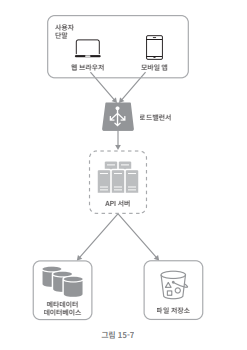

# 15. 구글 드라이브 설계

태그: 2023년 3월 2일 오후 7:48

## 구글 드라이브 설계

- 파일 업로드/다운로드, 파일 동기화, 알림
- 모바일 앱/웹
- 파일 크기 : 10GB 제한
- DAU : 천만명

---

### 기능 요구사항

- 파일 추가 (drag & drop)
- 파일 다운로드
- 여러 단말에 파일 동기화
- 파일 갱신 이력 조회
- 파일 공유
- 파일 편집, 삭제, 새롭게 공유되었을 때 알림 표시
- 동시 편집 → 설계 제외

---

### 비기능 요구사항

- 안정성 : 데이터 손실 No
- 빠른 동기화 속도 : 파일 동기화에 시간이 많이 걸리는 경우
- 네트워크 대역폭 : 네트워크 대역폭을 불필요하게 많이 소모하는 경우강 없어야 함
- 규모 확장성 : 많은 양의 트래픽이 처리 가능해야 함
- 높은 가용성 : 장애 발생, 느려짐, 네트워크 일부가 끊기는 경우에도 사용 가능해야 함

---

### 개략적 추정치

- 5000만 가입 사용자
- 1000만 DAU 사용자
- 모든 사용자에게 10GB의 무료 저장 공간
- 매일 평균 2개의 파일 업로드, 500KB
- 읽기: 쓰기 = 1:1
- 필요한 저장 공간 총량 = 5천만 사용자 x 10GB = 500페타바이트(Petabyte)
- 업로드 API QPS = 1천만 사용자 x 2회 업로드/24시간/3600초 = 약 240
- 최대 QPS = QPS x 2 = 480

---

## 개략적 설계안 제시 및 동의 구하기

> 일단, 한 대의 서버

- 파일 업로드, 다운로드 → 웹 서버
- 메타데이터 보관할 데이터베이스
- 파일 저장소 시스템 : 1TB

---

## API

1. **파일 업로드 API**
   1. **단순 업로드** : 파일 크기가 작을 때 사용
   2. `이어 올리기` : 파일 사이즈가 크고, 네트워크 문제로 업로드가 중단될 가능성이 높다고 생각될 때

      `/files/upload?uploadType=resumable`

      - 최초 요청 전송
      - 데이터 업로드 & 업로드 상태 모니터링
      - 업로드 장애 발생시점부터 업로드 재시작
2. **다운로드 API**

   `/files/download`

3. **파일 갱신 히스토리 제공 API**

   `/files/list_revisions`

> SSL 지원 프로토콜 : 클라이언트와 백엔드 서버가 주고 받는 데이터를 보호하기 위한 것

## 한 대의 서버 제약 극복

### 문제점) 파일 시스템 꽉참..!

⇒ 데이터를 샤딩하여 어러 서버에 나누어 저장

⇒ ~~(역시)~~ 아마존 S3

같은 지역 내 다중화, 여러 지역 다중화

### 다른 개선점..?)

- **로드밸런서**
  - 특정 웹 서버에 장애가 발생하면 자동으로 해당 서버 우회
- **`웹서버`**
  - 로드밸런서 추가하고 나면, 더 많은 웹 서버를 손쉽게 추가할 수 있음
  - 트래픽이 폭증해도 쉽게 대응이 가능
- **`메타데이터 데이터베이스`**
  - 데이터베이스를 파일 저장 서버에서 분리하여 `SPOF`를 회피
  - 가용성/규모 확장성
- **`파일 저장소`**
  - S3를 파일 저장소로 사용하고, 가용성과 데이터 무손실을 보장하기 위해 두 개 이상의 지역에 데이터 다중
    

## 동기화 충돌

- 오류가 발생한 시점에 두 가지 버전의 파일이 존재
- 사용자 2가 가지고 있는 로컬 사본과 서버에 있는 최신 버전
  - [4][5](https://www.youtube.com/watch?v=S2Hp_1jqpY8)] 를 읽어봐라..
  

## 더 나은 설계안..?)

파일저장소 기능별 분할(블록 저장소 서버, 클라우드 저장소-아카이빙 저장소), 메타데이터 캐시 추가, 알림 서비스(오프라인 사용자 백업 큐)

- **`블록 저장소 서버(block server)`**
  - 파일 블록을 클라우드 저장소에 업로드하는 서버
  - 블록 수준 저장소(block-level storage) : 클라우드 환경에서 데이터 파일을 저장하는 기술
  - 파일을 여러 개의 블록으로 나눠 저장 & 각 블록에는 고유한 해시값이 할당됨
    - 해시값은 메타데이터 데이터베이스에 저장됨
- 클라우드 저장소
  - 블록 단위로 나눠져 클라우드 저장소에 보관됨
- 아카이빙 저장소(cold storage)
  - 비활성 데이터를 저장하기 위한 컴퓨터 시스템
- 로드밸런서
  - 요청을 모든 API 서버에 고르게 분산
- API 서버
  - 파일 업로드 외에 거의 모든 것 담당.
  - 사용자 인증, 사용자 프로파일 관리, 파일 메타데이터 갱신
- **`메타데이터 데이터베이스`**
  - 사용자, 파일, 블록, 버전 등의 메타데이터 정보를 관리
  - 클라우드에 보관, 이 데이터베이스에는 오직 메타데이터만 둔다
- _메타데이터 캐시_
  - 성능을 높이기 위해, 자주 쓰이는 메타데이터는 캐시함
- _알림 서비스_
  - 특정 이벤트가 발생했음을 클라이언트에게 알리는데 쓰이는 발생/구독 프로토콜 기반 시스템
- **`오프라인 사용자 백업 큐(Offline backup queue)`**
  - 클라이언트가 접속 중이 아니라서 파일의 최신 상태를 확인할 수 없을 때, 이곳에 두어 나중에 클라이언트가 접속했을 때 동기화될 수 있도록

## ※ 블록 저장소 서버 ※

정기적으로 갱신되는 큰 파일들은 업데이트가 일어날 떄마다 전체 파일을 서버로 보내면 **네트워크 대역폭**을 많이 잡아먹게 된다.

- 델타 동기화 (delta sync)
  - 수정이 일어난 블록만 동기화
- 압축 (compression)
  - 데이터 크기를 많이 줄일 수 있음

압축

델타 동기화

1. 주어진 파일을 작은 블록들로 분할한다.
2. 각 블록을 압축한다.
3. 클라우드 저장소로 보내기 전에 암호화한다.
4. 클라우드 저장소로 보낸다.

⇒ 네트워크 대역폭 사용량 절감

### 높은 일관성 요구사항

- 강한 일관성 (strong consistency)모델을 기본으로 지원해야 한다.
- 메모리 캐시는 보통 최종 일관성(eventual consistency)모델을 지원한다.
- 캐시에 보관된 사본과 데이터베이스에 있는 원본이 일치한다.
- 데이터베이스에 보관된 원본에 변경이 발생하면, 캐시에 있는 사본을 무효화한다.

⇒ NoSQL는 동기화 로직 안에 프로그램해 넣어야 한다. `관계형 데이터베이스`를 채택하여 일관성 요구사항에 대응한다.

## ※ 메타데이터 데이터베이스 ※

device : 단말 정보 → 푸시 알람

user : 사용자에 관계된 기본적 정보들이 보관됨

namespace : 사용자의 루트 디렉터리 정보가 보관됨

file : 파일의 최신 정보가 보관됨

file_version : 파일의 갱신 이력이 보관되는 테이블

block : 파일 블록에 대한 정보를 보관하는 테이블

## [1] 업로드 절차

> **파일 메타데이터 추가**

1. 클라이언트 1이 새 파일의 **메타데이터를 추가하기 위한 요청 전송**
2. 새 파일의 메타데이터를 데이터베이스에 저장하고, **업로드 상태를 대기중으로 변경**
3. 새 파일이 추가되었음을 알림 서비스에 통지

1. 알림서비스는 관련된 클라이언트에게 파일이 업로드되고 있음을 알림

> **파일을 클라우드 저장소에 업로드**

2.1. 클라이언트1이 파일을 블록 저장소 서버에 업로드

2.2. 블록 저장소 서버는 파일을 블록 단위로 쪼갠 다음 압축하고 암호화한다음에 클라우드 저장소에 전송

2.3. 업로드가 끝나면 클라우드 스토리지는 완료 콜백을 호출, 이 콜백 호출은 API 서버로 전송됨

2.4. 메타데이터 DB에 기록된 해당 파일의 상태를 완료로 변경

2.5. 알림서비스에 파일 업로드가 끝났음을 통지

2.6. 알림 서비스는 관련된 클라이언트에게 파일 업로드가 끝났움을 알

## [2] 다운로드 절차

> **파일 편집 & 추가 감지 → 다운로드 자동으로 시작**

- 클라이언트 A가 접속 중, 다른 클라이언트가 파일을 변경하면, 알림 서비스가 클라이언트 A에게 변경이 발생했으니 새 버전을 끌어가야 한다고 알린다.
- 클라이언트 A가 네트워크에 연결된 상태가 아닐 경우에는 테이터는 캐시에 보관된다. 해당 클라이언트의 상태가 접속 중으로 바뀌면 그때 해당 클라이언트는 새 버전을 가져갈 것이다.

어떤 파일이 변경되었음을 감지한 클라이언트는 우선 API 서버를 통해 메타데이터를 새로 가져가야 하고, 그 다음에 블록들을 다운받아 파일을 재구성해야 한다.

1. 알림 서비스가 클라이언트 2에게 누군가 파일을 변경했음을 알림
2. 알림을 확인한 클라이언트2는 새로운 메타데이터를 요청
3. API 서버는 메타데이터 데이터베이스에게 새 메타데이터 요청
4. API 서버에게 새 메타데이터가 반환됨
5. 클라이언트2에게 새 메타데이터가 반환됨
6. 클라이언트2는 새 메타데이터를 받는 즉시 블록 다운로드 요청 전송
7. 블록 저장소 서버는 클라우드 저장소에서 블록 다운로드
8. 클라우드 저장소는 블록 서버에 요청된 블록 반환
9. 블록 저장소 서버는 클라이언트에게 요청된 블록 반환, 클라이언트 2는 전송된 블록을 사용하여 파일 재구성

## 알림 서비스

> 로컬에서 파일이 수정되었음을 감지하고, 다른 클라이언트에 그 사실을 알려서 충돌 가능성을 줄인다.

- **`롱 폴링(long polling)`** ; **`드롭박스`**
- **`웹 소켓(Web socket)`** : 클라이언트와 서버 사이에 지속적인 통신 채널을 제공→ 양방향 통신이 가능

⇒ 여기서는 롱 폴링 사용!

양방향 통신이 필요하지 않음

1. 실시간 양방향 통신이 요구되는 채팅같은 응용에 적합함
2. 구글 드라이브의 경우 알림을 보낼 일은 그렇게 자주 발생하지 않으며, 알림을 보내야 하는 경우도 단 시간에 많은 양의 데이터를 보낼 일은 없다.

## 저장소 공간 절약

1. 중복 제거(de-dupe) : 중복된 파일 블록을 해시값을 비교하여 제거
2. 지능적 백업 전략 도입
   1. 한도 설정
   2. 중요한 버전만 보관
3. 자주 쓰이지 않은 데이터는 아카이빙 저장소로 옮긴다.
   1. S3 glacier
4. 로드 밸런서 장애
   1. 장애시, 부 로드 밸런서가 활성화 되어 트래픽을 이어 받아야 한다.
   2. heartbeat 신호로 상태 모니터링
5. 블록 저장소 서버 장애
   1. 다른 서버가 미완료 상태 또는 대기 상태인 작업을 이어받아야 한다.
6. 클라우드 저장소 장애
   1. s3 여러 지역 다중화
7. API 서버 장애
   1. 장애시, 트래픽을 해당 서버로 보내지 말기
8. 메타데이터 캐시 장애
   1. 메타데이터 캐시 서버 다중화
   2. 한 노드에 장애가 생겨도 다른 노드에서 데이터를 가져올 수 있다
   3. 장애가 발생한 서버는 새 서버로 교체한다.
9. 메타데이터 데이터베이스 장애
   1. 주 데이터베이스 서버 장애
      1. 부 데이터베이스 서버 가운데 하나를 주 데이터베이스 서버로 바꾸고, 부 데이터베이스 서버를 새로 하나 추가
   2. 부 데이터베이스 서버 장애
      1. 다른 부 데이터베이스 서버가 읽기 연산을 처리하도록 하고, 그동안 장애 서버는 새 것으로 교체
10. 알림 서비스 장애
    1. `롱 폴링 연결 유지` → 연결 수 1백만 개.. → 장애시,, 다시 그 연결들을 다시.. 만들어야 함 → 동시에 백만 개 접속을 시작하는 것은 불가능 → 상대적으로 롱 폴링 연결 복구 느림
11. 오프라인 사용자 백업 큐 장애 : _큐에 장애가 발생하면 구독 중이 클라이언트들은 백업 큐로 구독 관계를 재설정해야 한다._
