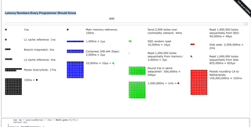
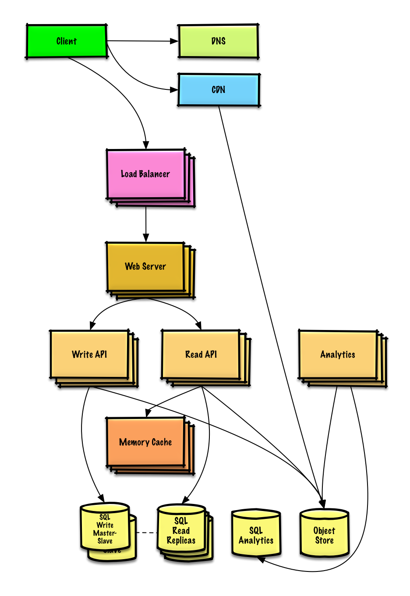
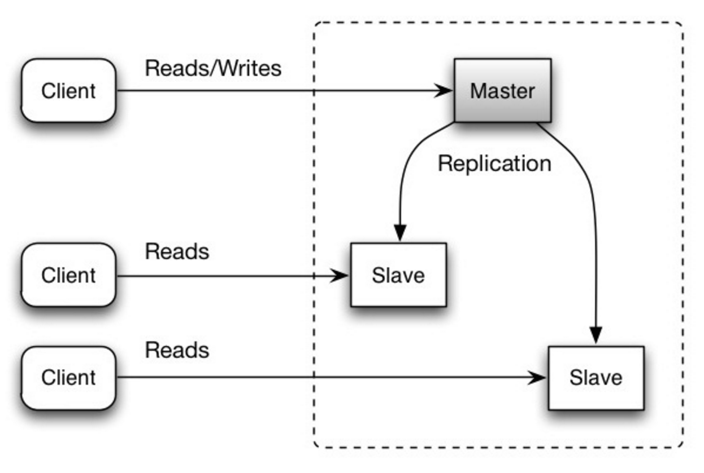
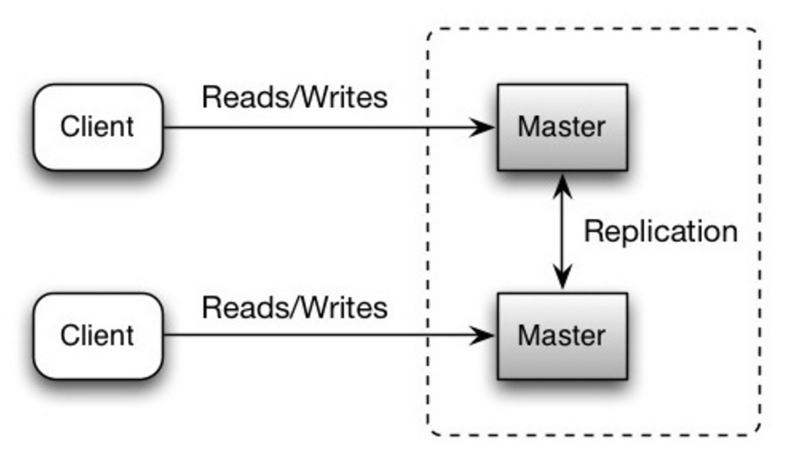

# 2장 개략적인 규모 추정

# 서론

## 목적

- 개략적인 규모 추정은 성능 수치상의 사고 실험을 통해, 
  어떤 설계가 부합한지 확인해 보기 위한 것.

## 필요사항

- 2의 제곱수
- 응답지연 값
- 가용성에 관계된 수치

# 개념들

## 2의 제곱수

- 데이터 볼륨 단위
  - 최소 단위 1바이트 (8비트 구성)
  - 인코딩에 따른 메모리 크기 ([링크](https://halfmoon9.tistory.com/61))
    - 아스키: 1바이트(8비트)
    - 유니코드: 1바이트(영어, 숫자) 혹은 3바이트(한글 등)
    - UTF-8 (가변길이 인코딩): 1바이트 ~ 4바이트
- 데이터 볼륨 단위

| 2의 제곱 | 근사치                | 이름        | 축약형 |
| -------- | --------------------- | ----------- | ------ |
| 10       | 1천 (thousand)        | 1킬로바이트 | 1KB    |
| 20       | 1백만 (million)       | 1메가바이트 | 1MB    |
| 30       | 10억 (billion)        | 1기가바이트 | 1GB    |
| 40       | 1조 (trillion)        | 1테라바이트 | 1TB    |
| 50       | 1000조 (quardrillion) | 1페타바이트 | 1PB    |

## 응답지연 값

- 컴퓨터와 관련된 응답지연 값 (2010년)
  - 메모리에서 1MB 순차적으로 Read: 250,000ns (1)
  - 디스크에서 1MB 순차적으로 Read: 30,000,000ns (120)
  - 패킷 하나의 캘리포니아 - 네덜란드 왕복: 150,000,000ns (600)
  - 디스크 탐색: 10,000,000ns
  - 1KB 압축: 100ns
- 결론
  - 메모리는 빠르지만 디스크는 여전히 느림
  - 디스크 탐색은 피하자
  - 단순 압축 빠름
    → 인터넷으로 전송할거면 압축해라
  - 데이터 센터는 분산되어 있음!
    → 센터들 간의 데이터 주고 받고 시간이 걸려

<aside>
💡 추가 자료

- HDD에서의 순차 읽기 속도는 30 MB/s 입니다.
- 이더넷에서의 순차 읽기 속도는 100 MB/s 입니다.
- SSD에서의 순차 읽기 속도는 1 GB/s 입니다.
- 메인 메모리에서의 순차 읽기 속도는 4 GB/s 입니다.
- 1초에 지구 6-7바퀴를 돌 수 있습니다.
- 1초에 데이터 센터와 2,000번 round trip 할 수 있습니다.
</aside>

## 가용성에 관계된 수치

- 얼마나 오랜 시간 동안 중단없이 운영될 수 있는가?
- SLA(Service Level Agreement) → 서비스 사업자가 고객에게 제공하는 서비스 가용시간
  | 가용률 | 연간 장애 시간 |
  | -------- | -------------- |
  | 99% | 3.65일 |
  | 99.9% | 8.77시간 |
  | 99.99% | 52.60분 |
  | 99.999% | 5.26분 |
  | 99.9999% | 31.56초 |
  - 아마존의 SLA ([링크](https://aws.amazon.com/ko/legal/service-level-agreements/))
    - EC2 ([링크](https://d1.awsstatic.com/legal/AmazonComputeServiceLevelAgreement/Amazon%20Compute%20Service%20Level%20Agreement_Korean_2020-07-22.pdf))
      Q: Amazon EC2 서비스 수준 계약에서 보장하는 내용은 무엇입니까? 
      A: SLA는 리전 내 Amazon EC2 및 Amazon EBS에 대해 최소 99.99%의 월간 가동률을 보장합니다.

# 질문

## 트위터 QPS와 저장소 요구량 추정

- 가정
  - MAU 3억명
  - 50% 의 사용자가 트위터를 매일 사용함
  - 평균적으로 사용자는 매일 2건의 트윗을 올림
  - 미디어를 포함한 트윗은 10%
  - 데이터는 5년간 보관
- 추정
  - QPS(초당 쿼리) 추정치
    - DAU = MAU \* 매일 사용하는 사용자 = 3억/2 = 1.5억
    - QPS = (DAU \_ 사용자가 올리는 트윗 수) / 24시간 \* 3600초 = 3500
    - 최대 QPS(peek QPS) = 2\* QPS = 7000  
      (최대 QPS를 구하는 법은 그냥 2배를 하는 것인가..?)
  - 미디어 저장소 요구량
    - 평균 트윗 크기
      - t_id 64바이트
      - 텍스트 140바이트
      - 미디어 1MB
    - 미디어 저장소 요구량
      - for 하루: DAU _ 사용자가 올리는 트윗 수 _ 미디어를 포함하는 비율 \* 미디어 용량 = 30TB
      - for 5년: 30TB _ 365 _ 5 = 약 55PB

# 팁

- 문제를 풀어나가는 절차 (해결능력) 중요
- 근사치를 활용한 계산 (복잡한 계산 버리고 약)
- 가정 (if) 를 적어두기
- 단위 붙이기
- 면접에서는 QPS, 최대 QPS, 저장소 요구량, 캐시 요구량, 서버 수 추정하는 것

# 참고 문헌

## **응답 지연 값 (접속 안됨)**

[Google Pro Tip: Use Back-of-the-envelope-calculations to Choose the Best Design - High Scalability -](https://highscalability.com/blog/2011/1/26/google-pro-tip-use-back-of-the-envelope-calculations-to-choo.html)

## **아마존 SLA**

[AWS 서비스 수준 계약(SLA)](https://aws.amazon.com/ko/legal/service-level-agreements/)

## \***\*Latency Numbers Every Programmer Should Know\*\***

[Numbers Every Programmer Should Know By Year](https://colin-scott.github.io/personal_website/research/interactive_latency.html)

## **system-design-primer (한국어!)**

## SDP **요약**

### 시스템 설계 면접 질문에 접근하는 방법

- **STEP1**. 시스템 **사용 사례 개요, 제약, 추정치** 등 파악
  - 누가 해당 서비스를 사용하는지?
  - 어떻게 사용할 것인지?
  - 사용자의 규모는 어떠한지?
  - 시스템은 어떠한 기능을 해야 하는지?
  - 시스템의 입력과 출력은 무엇인지?
  - 얼마나 많은 양의 데이터를 처리할 것으로 예상되는지?
  - 초당 요청 건수가 얼마나 될 것으로 예상되는지?
  - 예상되는 쓰기 및 읽기 작업의 비율은 어떻게 되는지?
- **STEP2**. 보다 **높은 수준**의 설계
  - 주요 구성 요소 및 연결부 스케치
  - 생각한 근거
- **STEP3**. **핵심 구성** 요소를 설계 (예시, 단축 URL)
  - 전체 URL의 해쉬 생성 및 저장 작업 진행
    - [MD5](https://vscode-vfs+github-002b7b2276223a312c22726566223a7b2274797065223a332c226964223a22343736227d7d.vscode-resource.vscode-cdn.net/donnemartin/system-design-primer/solutions/system_design/pastebin/README.md)와 [Base62](https://vscode-vfs+github-002b7b2276223a312c22726566223a7b2274797065223a332c226964223a22343736227d7d.vscode-resource.vscode-cdn.net/donnemartin/system-design-primer/solutions/system_design/pastebin/README.md)
    - 해쉬 충돌
    - SQL 또는 NoSQL
    - 데이터베이스 스키마
  - 해쉬화된 URL를 전체 URL로 변환
    - 데이터베이스 lookup
  - API와 객체 지향 설계
- **STEP4**. 시스템 설계 **확장**
  - 로드 밸런서
  - 수평 스케일링
  - 캐싱
  - 데이터베이스 샤딩

### 시스템 설계 면접 질문 목록

- **Pastebin.com (또는 Bit.ly) 설계**
  - **구조 및 해답 토글**
    [system-design-primer/solutions/system_design/pastebin at master · donnemartin/system-design-primer](https://github.com/donnemartin/system-design-primer/tree/master/solutions/system_design/pastebin)
    

### 기타 관련된 내용들

- **성능 VS 확장성**
  - 자원의 추가로 성능이 향상됨 → 서비스 확장
  * 성능 향상: 더 많은 작업을 할 수 있다!
  - 성능에 문제가 있을 경우, 단일 사용자의 시스템 속도가 느려진다
  - 확장성에 문제가 있을 경우, 
    단일 사용자의 시스템 속도는 빠르지만, 
    부하가 많을 경우 느려진다 
- **지연 시간 VS 처리량**
  - 지연시간: 결과를 산출하기 위해 필요한 시간
  - 처리량: 결과 산출이 단위 시간으로 이루어지는 것을 수치화 한 것
- **가용성 VS 일관성**

  - 분산 컴퓨터의 경우 다음 중 2개만 보장 가능
    - 일관성 Consistency : 분산 컴퓨터 간의 데이터 동일
    - 가용성 Availability : 최신 정보라는 보장은 없지만, 항상 응답
    - Partition Tolerance : 분산 컴퓨터 간의 네트워크에 의한 단절이 있어도,  
      각각의 시스템은 동작
  - 위의 3가지 중, 네트워크는 못 믿어 ⇒ Partition Tolerance는 무조건 지원해야 함! 
    - CP 
      분할된 노드에서 요청을 기다리는 동안 타임아웃 발생 가능. 
      원자성 RW 가 중요한 경우 좋은 선택 
    - AP 
      항상 최선의 데이터의 보장은 아님. 
      오류와 관계 없이 지속적으로 동작 가능한 시스템에 좋은 선택

- **가용성 유형들** 고가용성을 지원하는 2가지 유형
  - 페일오버
    - 액티브 - 패시브 : 액티브가 죽으면, 패시브가 액티브 IP주소 가져와서 서비스 재시작
    - 액티브 - 액티브 : 두 서버가 부하를 분산하여 처리
  - 복제
    - 마스터 - 슬레이브: 마스터가 요청 반영하고, 하나 이상의 읽기 전용 슬레이브 DB에 복제함
      
    - 마스터 - 마스터: 둘다 RW 가능, 하나가 죽어도 시스템 자체는 지속적 사용!
      
- 가용성에서의 직렬, 병렬
  - 직렬: 가용성 (총합) = 가용성 (Foo) \* 가용성 (Bar) ⇒ **전체 가용성 감소**
  - 병렬: 가용성 (총합) = 1 - (1 - 가용성 (Foo)) \* (1 - 가용성 (Bar)) ⇒ **전체 가용성 증가 \*** 만약 `Foo`와 `Bar`의 가용성이 각각 99.9%인 경우 총 가용성은 99.9999% 입니다.
