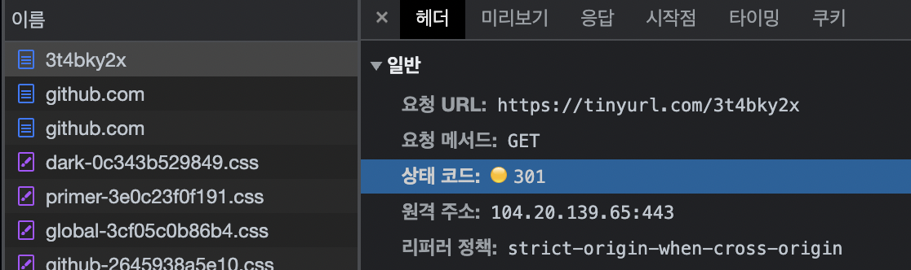
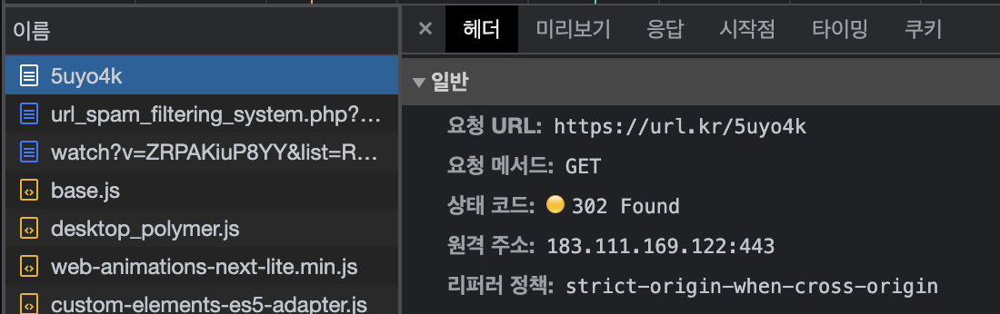

## 📌 서론

- tiny URL 과 같은 URL 단축기를 설계하는 것
  [링크](https://tinyurl.com/app)

### 📚 개발 전 확인 사항

- 트래픽 규모
- 단축의 정도
- 단축의 형태
- 제공해야 하는 기능 (CRUD)

### 📚 시스템 요구사항

- URL 단축: 주어진 긴 URL 단축
- URL 리다이렉션: 축약된 URL로 HTTP 요청이 오면 본래 URL로 안내
- **높은 가용성**과 **규모 확장** 고려 필요

### 📚 사용량 추정

- 쓰기 연산: 1억개 단축 URL 생성 / 1Day
- 초당 쓰기: 1억 / 24 / 3600 = 1160
- 읽기 연산: 읽기, 쓰기 비율을 10:1이라고 가정. 초당 11600회
- URL 단축 서비스 10년 유지: 1억 _ 365 _ 10 = **3650억**
- 축약 전 URL 평균 길이 100
- 10년간 필요한 용량 3650 \* 100바이트

## 📌 구현

### 📚 개략적인 설계안

- API 엔드포인트

  ```jsx
  POST /api/v1/data/shorten
  - 인자 : {longUrl : longURLString }
  - 반환 : 단축 URL
  ```

  ```jsx
  GET /api/v1/shortUrl
  - 반환 : HTTP 리다이렉션 목적지가 될 원래 URL
  ```

  - 301 Permanently Moved:
    Url에 대한 HTTP 요청의 처리 책임이 영구적으로 이전되었다는 뜻
    **영구적**인 이동이므로, 브라우저는 응답을 캐싱함
    ⇒ 서버 부하를 줄일 수 있음

  - 302 Found:
    **일시적**으로 타 URL에 의해 처리되어야 한다는 응답
    ⇒ 트래픽 분석이 가능함

    > 현재 서비스 중인,
    > 여러 URL 단축 서비스는 302 형태로 대부분 서비스를 제공하지만,
    > 사용자 분석 툴 기능을 제공하지 않는 일부 무료 플랜의 경우,
    > 301 형태로 응답을 받음.
    > 단, 302 형태로 데이터 분석 기능이 포함되는 경우,
    > 같은 URL을 단축 하더라도,
    > 단축 결과가 다름





- URL 단축
  - 입력으로 들어오는 URL 값이 다르면, 해쉬의 결과도 달라야 함
  - 짧은 URL을 원래 URL로 변환할 수 있어야 함

### 📚 설계

- 데이터 모델
  - <단축, 원래>의 순서쌍을 관계형 DB에 저장한 방법
    `id`, `shortURL`, `longURL` 칼럼을 가짐
- 해쉬 함수
  - 해쉬 충돌 후 해소, base-62 두가지 방법이 있음
    \*base62: 62진법으로, 해쉬 한자리수가 표현할 수 있는 url의 수
  - 단축 URL 값을 `hash값` 이라고 표현
  - 원래 URL을 7글자로 줄이는 해시 함수 필요
- 해쉬 충돌 후 해소
  - CRC32, MD5, SHA-1 과 같은 해시 함수를 이용할 수 있음
  - 단, 해시 결과 값이 7글자보다 길어
  - 과정
    1. 단축 해야할 URL 입력
    2. 해시 함수를 통해서 단축 URL 생성
    3. 생성된 단축 URL이 DB에 있는지 체크
       1. 있을 경우 본래 URL에 사전에 정한 문자열을 임의로 추가하여,
          1번 으로 이동
       2. 없을 경우, 4번으로 이동
    4. DB에 저장
    5. 종료
  - 이 과정은, 단축 URL을 생성할 때,
    한 번 이상 DB 접근이 있어서 오버헤드가 큰 편.
    단, DB대신 [블룸 필터](https://ko.wikipedia.org/wiki/%EB%B8%94%EB%A3%B8_%ED%95%84%ED%84%B0) (확률적 자료구조)를 사용하면 성능을 높일 수 있음
- base-62 변환
  - `hash값` 은 [0-9, a-z, A-Z]의 문자로 구성
    해쉬 값 길이 당, 연결할 수 있는 URL의 수: 62개 / N
    요구사항을 만족하기 위해서는 62^n > 3650억에서 n의 최솟값을 구해야 함 (7)
  - 진법 변환은 URL 단축키를 구현할 때 흔히 사용되는 접근법
  - 위에서 사용할 수 있는 문자열의 수를 62개로 세팅
  - 단, BASE 62는 ID가 이미 유일하다고 가정
    - 책에서 제안한 유일한 ID 생성 방법은,<br />
      7장의 트위터 스노플레이크 접근방법<br />
      **[ 0(1비트) | 타임 스탬프 (41) | 데이터센터ID (5) | 서버ID(5) | 일련번호(12) ]**
    - ~~❌ 그러면 굳이 또 base62로 변환해야 하는이유가 있나?
      유일한 ID를 그냥 [0-9, a-z, A-Z]의 문자로 구성하면 안되나…~~<br />
      ⇒ 유일ID 가 너무 길수도 있음
      그렇지만 분산 컴퓨팅 환경이 아니라면,<br />
      그냥 auto inc 값을 기본 키값(shot URL)으로 해도 문제는 없을 것 같다.
- 해쉬 충돌 후 해소 VS base-62 변환
  | 해시 충돌 후 해소 | base-62 변환 |
  | -------------------------------------------------------------------------- | ------------------------------------------------ |
  | 단축 URL 길이가 고정됨 | 단축 URL 길이 가변적, ID 값이 커지면 같이 길어짐 |
  | 유일성이 보장되는 ID 생성기 필요 X | 유일성 보장 ID 생성기 필요 |
  | 충돌 가능. |
  | 해소 전략 필요 | 충돌 불가 |
  | ID로부터 단축 URL을 계산하는 것 X. |
  | 다음에 사용가능한 URL을 알아내는 것 보안 수준 상대적 높음 | ID가 1씩 증가하는 값이라고 가정, |
  | 다음에 쓸 수 있는 단축 URL이 무엇인지 쉽게 알아낼 수 있어 보안상 문제 존재 |

### 📚 URL 단축기 상세 설계

- **다이어그램**
  1. 본래 URL 입력
  2. 입력된 URL이 있는가?
     1. 있다면, DB에서 찾은 단축 URL 반환
     2. 없다면, 3번 이동
  3. 새로운 ID 생성 by 62진법
  4. 생성된 ID를 단축 URL로 변환
  5. ID, 단축 URL, 원래 URL을 DB에 저장
- ❌ 근데 그러면 이러나 저러나, 오버헤드는 비슷한게 아닌가…<br />
  해쉬 충돌 후 해결과 다른 점이라면,<br />
  62진법은 ID가 겹치지 않아서,<br />
  DB 조회를 한번만 하면 된다는 것, 하지만 유일한 ID를 생성해야함.<br />
  해쉬 충돌 후 해결은,<br />
  충돌 발생하면 다시 해싱하고 또 DB에 접근.<br />
  ⇒ 만약, 해쉬 충돌 가능성이 낮다면, 오히려 해쉬 충돌 후 해결이 좋은 방법이지 않을까…!

### 📚 URL 리다이렉션 상세

- 작동 로직
  1. 사용자가 단축 URL 클릭
  2. 로드밸런서가 요청 서버에 전달
  3. 단축 URL이 캐시에 있다면, 바로 클라이언트에 전달
  4. 캐시에 없으면, DB 조회 후 전달

## 📌 마무리

### 📚 개선 가능한 부분

- 처리율 제한 장치
  - IP주소를 비롯한 필터링 규칙 활용
- 웹 서버의 규모 확장
  - 무상태 게층이므로, 웹 서버 확충 등이 가능
- 데이터베이스의 규모 확장
  - DB 다중화 혹은 샤딩
- 데이터 분석 솔루션
  - 어떤 링크를 얼마나 많은 사용자가 클릭했나
- ACID
